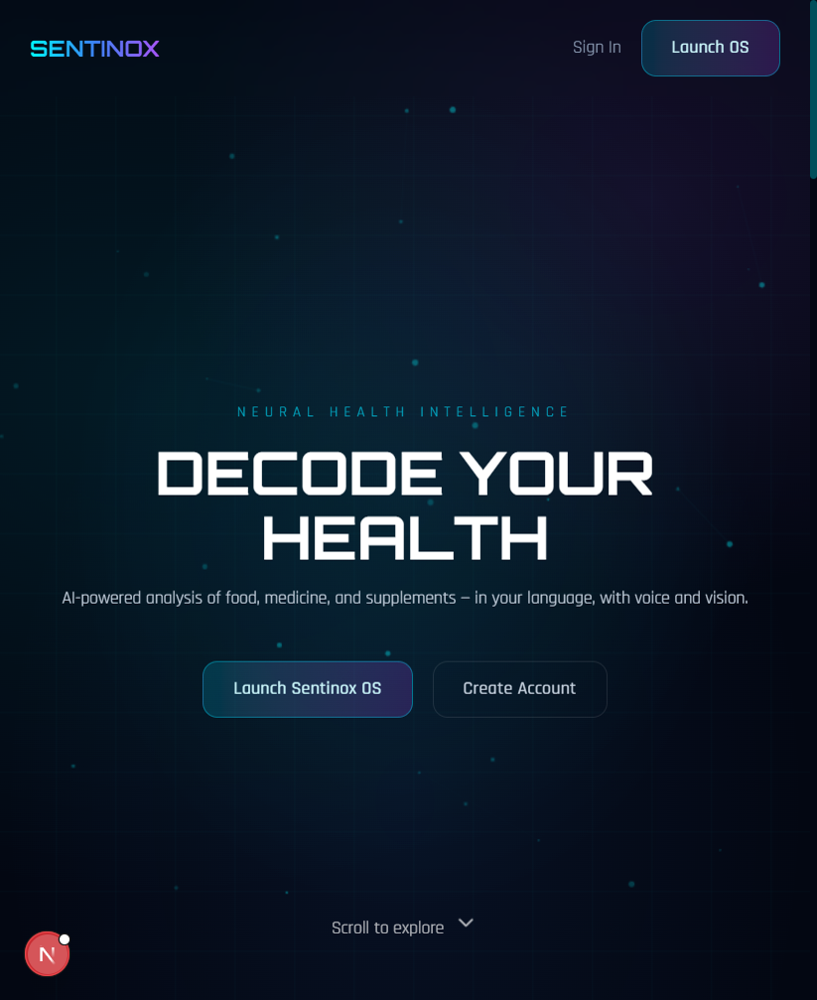
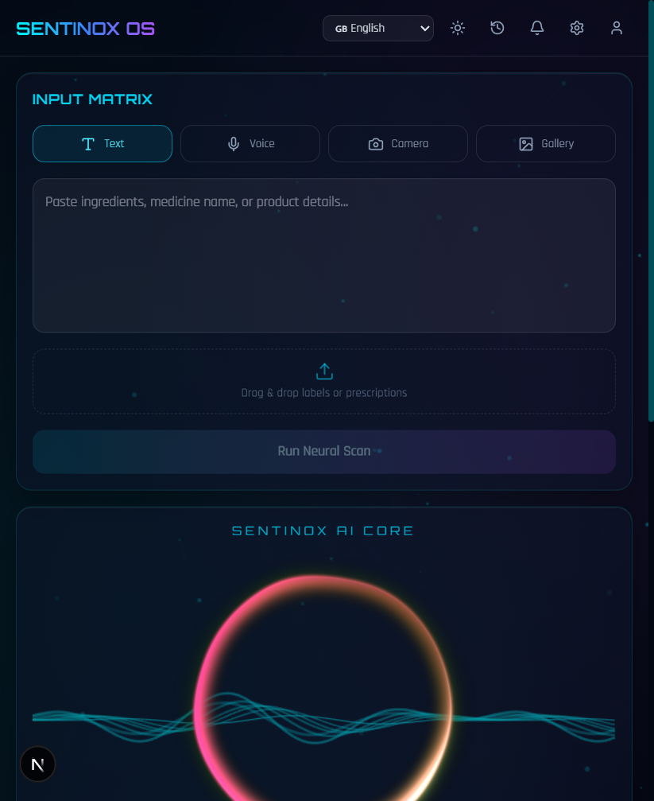
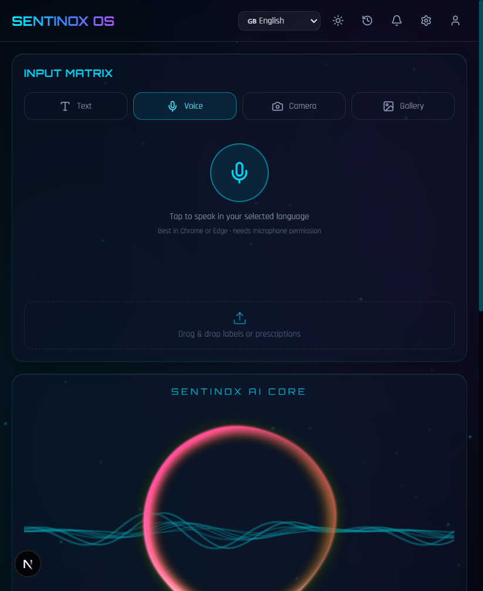
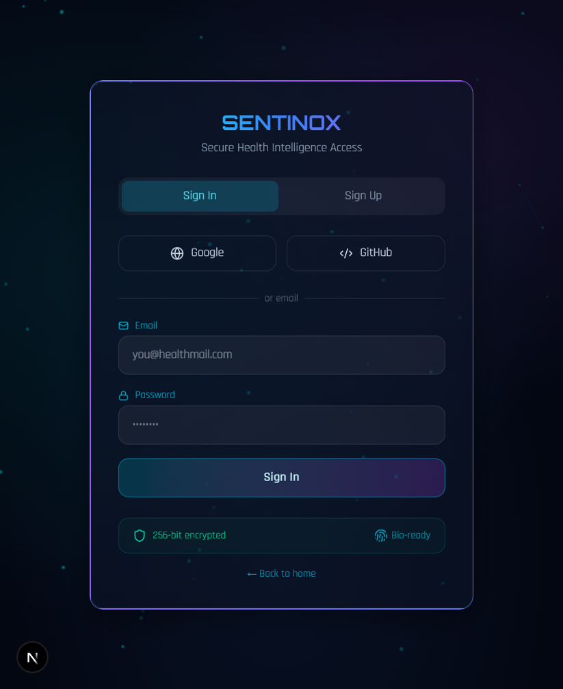

<div align="center">

# Sentinox

### Neural Health Intelligence Platform

**Decode your health** — AI-powered analysis of food, medicine, and supplements in **30+ languages**, with **voice**, **vision**, and a cinematic futuristic UI.

[](https://nextjs.org/)
[](https://www.typescriptlang.org/)
[](https://tailwindcss.com/)
[](LICENSE)

[Report Bug](https://github.com/drax369/sentinox/issues) · [Request Feature](https://github.com/drax369/sentinox/issues)

</div>

---

## Preview

<table>
  <tr>
    <td align="center" width="50%">
      
      <br /><sub><b>Landing</b> — cinematic hero & feature showcase</sub>
    </td>
    <td align="center" width="50%">
      
      <br /><sub><b>Workspace OS</b> — input matrix, AI core & analysis panel</sub>
    </td>
  </tr>
  <tr>
    <td align="center" width="50%">
      
      <br /><sub><b>Voice Input</b> — speak in your selected language</sub>
    </td>
    <td align="center" width="50%">
      
      <br /><sub><b>Auth</b> — secure sign-in with social & biometric-ready UI</sub>
    </td>
  </tr>
</table>

---

## What is Sentinox?

Sentinox is a next-generation **healthcare AI web platform** that helps users understand consumable products — medicines, supplements, packaged foods, and labels — through an immersive **“health OS”** experience.

Scan a product via **text**, **voice**, **camera**, or **file upload**, and receive structured insights: ingredients, benefits, risks, drug interactions, safe dosage, alternatives, and a simplified explanation — **fully localized** to your language.

---

## Features

| Feature | Description |
|--------|-------------|
| **Multi-modal input** | Text, voice (Web Speech API), camera, gallery, drag-and-drop |
| **30+ languages** | UI, placeholders, analysis output, and TTS in Indian & global languages |
| **Holographic AI core** | Voice-powered orb with live waveform visualizer |
| **Analysis engine** | Ingredients, risks, interactions, dosage, condition suitability |
| **Voice playback** | Hear simplified explanations in your language |
| **Health profile** | Allergies, conditions, medications, dietary restrictions |
| **Scan history** | Timeline of past analyses with notifications |
| **Cyber glass UI** | Dark/light theme, particle fields, mesh gradients, Framer Motion |

---

## Tech Stack

- **Framework:** [Next.js 16](https://nextjs.org/) (App Router) + React 19
- **Language:** TypeScript
- **Styling:** Tailwind CSS 4, glassmorphism design system
- **3D / Effects:** Three.js, React Three Fiber, OGL, Framer Motion
- **State:** Zustand (persisted profile & preferences)
- **Data:** TanStack React Query
- **Voice:** Web Speech API (STT + TTS), WebRTC microphone capture
- **i18n:** Custom locale packs + BCP-47 speech locales

---

## Getting Started

### Prerequisites

- **Node.js** 20+
- **npm** 10+
- **Chrome or Edge** (recommended for voice input)

### Install & run

```bash
git clone https://github.com/drax369/sentinox.git
cd sentinox
npm install
npm run dev
```

Open **[http://localhost:3000](http://localhost:3000)** — you’ll be guided through the loading sequence, then the landing page.

```bash
npm run build   # production build
npm start       # run production server
```

> **Tip:** Run only one `npm run dev` instance. If port 3000 is busy, stop other Node processes first.

---

## Routes

| Route | Description |
|-------|-------------|
| `/` | Redirects to loading → landing |
| `/loading` | Neural boot sequence with voice-powered orb |
| `/landing` | Marketing page — features, languages, testimonials |
| `/auth` | Sign in / sign up, social auth UI, biometric-ready |
| `/workspace` | Core OS — scan, analyze, assistant, history |
| `/api/analyze` | POST — product analysis (localized mock engine) |

---

## Language support

Select any language from the workspace header dropdown. The entire flow adapts:

- Input placeholders & UI labels  
- Voice recognition (with Chrome locale fallbacks for rare languages)  
- Analysis output (summary, ingredients, risks, recommendations)  
- Text-to-speech playback  

Supported codes include **English, Hindi, Bengali, Telugu, Tamil, Marathi, Gujarati, Kannada, Malayalam, Punjabi, Urdu**, and more — plus **Spanish, French, German, Arabic, Chinese, Japanese, Portuguese, Russian**.

---

## Project structure

```
sentinox/
├── docs/images/          # README screenshots
├── src/
│   ├── app/              # App Router pages & API routes
│   ├── components/       # UI, workspace, landing, effects, three
│   ├── hooks/            # useI18n, useVoiceCapture, useSpeech, useAnalyze
│   ├── lib/              # i18n, languages, mock analysis
│   ├── providers/        # React Query, theme, language sync
│   ├── stores/           # Zustand (app + analysis)
│   └── types/            # TypeScript definitions
├── public/
└── package.json
```

---

## API & backend

The included `/api/analyze` route returns **intelligent localized mock data** for demos. For production:

1. Replace `generateMockAnalysis` in `src/lib/mock-analysis.ts`, or  
2. Point `useAnalyze` to your backend (e.g. Fastify + Grok with `localizeResult`).

---

## Screenshots (full width)

<p align="center">
  
</p>

<p align="center">
  
</p>

---

## Contributing

Contributions are welcome! Please open an issue or PR on [github.com/drax369/sentinox](https://github.com/drax369/sentinox).

1. Fork the repository  
2. Create a feature branch (`git checkout -b feature/amazing-feature`)  
3. Commit your changes  
4. Push to the branch  
5. Open a Pull Request  

---

## Author

**Dhanush** — [@drax369](https://github.com/drax369)

---

<div align="center">

**Built with care for safer, smarter health decisions.**

If this project helps you, consider giving it a star on GitHub.

</div>
